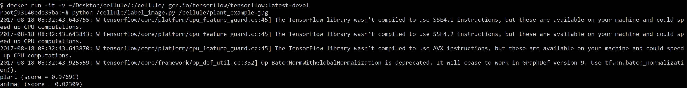
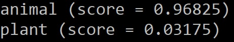

# Cellule - A Tensorflow Plant and Animal Cell Image Classifier

Cellule is a TensorFlow Image Classifer that can be used to classify an image of cells and determine whether or not it is an image of Plant cells or an image of Animal cells.

Accuracy - 95% (Approx.) 

## Requirements

* [docker](https://www.docker.com/products/docker-toolbox)

## Usage 

1. Open the Docker Quick Start Terminal.
2. Download the zip file from GitHub and extract the files to your Desktop.
3. Rename the extracted folder to - "cellule".
4. Link the already trained inception v3 model to the docker container by entering the following command in the Docker Terminal next to the "$" - 
```
docker run -it -v ~/Desktop/cellule/:/cellule/ gcr.io/tensorflow/tensorflow:latest-devel
```
5. Now the Docker Terminal should display a line of code with something like - "root@ ... :~#".
6. Now enter the following command next to the "#" - 
```
python /cellule/label_image.py <image_location>
```
7. Here, the "<image_location>" refers to the path where the image that needs to be classified is located.

For example - 




## Results


     


     


## Theory Behind The Machine Learning Algorithm

Cellule takes in the picture of either a plant or an animal cell as an input and used a series of multiple hidden layers in a Convolutional Neural Network (CNN) to build an Inception v3 model that allows the TensorFlow program to automatically create its own features. It then uses these features (parameters) to classify and determine if the given picture is one that contains plant cells or animal cells.
The Inception v3 model is made up of many layers stacked on top of each other and these layers are pre-trained and are very essential at finding and summarizing information that will help classify most images. This helps in generating the bottleneck (The layer before the final output layer of the CNN that actually classifies the given image) and every inputted image is then run through this bottleneck in order to classify the given image based on the already trained Convolutional Neural Network (CNN). 

# Credits

Credit goes to [Xblaster](https://github.com/xblaster) for the base/boilerplate code that enabled me to create the Inception v3 model.


